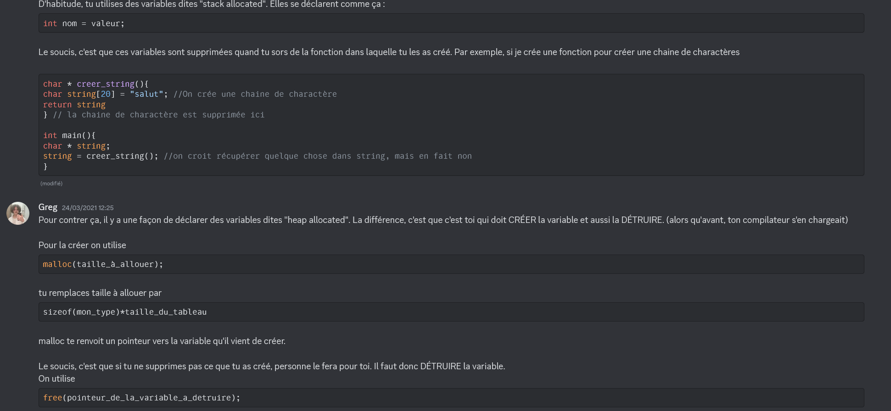
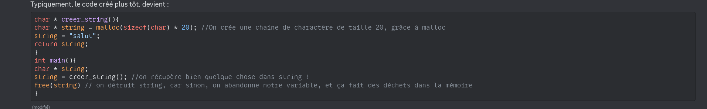

<h1 style="text-align: center;">Thank you for your interest in CleverCloud!</h1>

At CleverCloud, we want to rethink what a Cloud Service Provider should be for businesses and developers around the world. We deal with complexity so that our customers don’t have to. Our mission is simple: Build a powerful, versatile yet simple to use, Cloud Platform.

**We are looking for engineers who share our mission.**

<br/>

Our most deeply held engineering belief is in the deep understanding of technology. Mastering a domain area can be a life challenge, and there isn’t always a clear path to solve a problem. As if that weren’t enough, we believe that true magic happens when hardware and software are designed to work with one another. Generally speaking, deep understanding is key for good engineering designs.

**We are looking for engineers who like to solve hard problems.**

<br/>

At CleverCloud, we have simple values we think are important to work together. Differences between people are the driver to an open mindset which turns to be key to engineering: surpass our own belief, understand alternative ways of thinking or rethink the status quo.

<div align="center">
<table>
  <tr>
   <td>Candor
   </td>
   <td>Diversity
   </td>
   <td>Optimism
   </td>
   <td>Rigor
   </td>
   <td>Transparency
   </td>
  </tr>
  <tr>
   <td>Courage
   </td>
   <td>Empathy
   </td>
   <td>Resilience
   </td>
   <td>Teamwork
   </td>
   <td>Urgency
   </td>
  </tr>
  <tr>
   <td>Curiosity
   </td>
   <td>Humor
   </td>
   <td>Responsibility
   </td>
   <td>Thriftiness
   </td>
   <td>Versatility
   </td>
  </tr>
</table>
</div>

**We are looking for engineers who share our values.**

<br/>

We believe that the best basis for assessment of an engineer is not through their performance on an arbitrary oral exam, but rather through their own expression. That’s why we use interviews to deeply understand the complete engineer who your work indicates you to be.

You should find that these candidate materials will take no more than a couple of hours to gather; please fork or clone this document, and for each section, please use the space you need, expanding into additional pages as necessary. When completed, please export this document as a PDF and submit it with your application at jobs _AT_ clever-cloud.com. Note we mostly use english for written work, unless it's a real issue for you, please use english to answer.

<br/><br/>

<h2 style="text-align: center;">Questionnaire</h2>

Please answer the following questions, using as much space as you need. All of these questions are important, but the final question is probably the most important one; take your time in answering it!

**_What work have you found most technically challenging in your career and why?_**

As I'm undertaking an apprenticeship, I get to see very different types of technical challenges : at work it's rather about the codebase scale and the ecosystem complexity, whereas at school, I face (and try to brave !) algorithmic complexity and hard concepts like low-level programming, AI, constraint programming or dynamic programming to name a few.

In my efforts to always improve and grow, I try to make each project a little bit more ambitious than the last one (as my darkcircles testify, I sometimes set my goals a bit high). So the work that I found the most challenging is naturally the latest I accomplished ! It involved every type of complexity I ever faced.

[Cellion](https://github.com/GregoireBellon/cellion/) was a school project, built for [LERIA](https://leria.univ-angers.fr/)'s researchers. As you might know, generating a timetable satisfying a list of constraints is a hard problem. LERIA's researchers are building a solver that takes some hyperparameters as inputs and outputs a solution as a multi-thousand lines XML file. The quality of the solution depends on the hyperparameters values, as well as on the overall quality of the solver of course. To iterate on the solver quickly, the researchers needed a tool that enables them to visualize and query solutions that were generated.

The tool had to be very fast, and be able to load and query on solutions of several GBs. This is what we worked on : I built the back, my **partner in grind** [@suromain](https://github.com/suromain) built the front, and we both built the CIs.

It was challenging because I had three weeks to design and build a system which had to handle files potentially bigger than its host's RAM, and load them as fast as possible. I thought about network latency (that led me to use SQLite), back and forth with the database (solved with transactions and buffers flushed only when a certain number of entities are to be sent) and code efficiency. We also decided to setup a complete set of CI/CD pipelines, so that our supervisors could send us feedback directly after we commited.

Also, I chose to use Rust without any experience with it (4 days of advent of code shall not count as experience). As I said, I sometime set my goals a bit high. I had to learn how to use the language and [some more librairies](https://github.com/GregoireBellon/cellion/blob/main/back/Cargo.toml) and I had a fantastic time doing it.

In order to parse the XML file, I also built a [little wrapper over Quick-XML](https://github.com/GregoireBellon/cellion/blob/main/back/src/xml_parsing/reader.rs). It uses buffers to only store in memory what's between two XML tags, and trigger a closure when a tag matches an XPATH. It's fast, has a low memory footprint, and I find the DX really neat :

```rust
let mut router: Router<BufReader<File>, EventHandlingError, SolutionInserter> = vec![
    XmlRouting {
        route: vec!["tag", "subtag", "tagToMatch"],
        handler: Box::from(
            |event: Event,
                parser: &mut XmlParser<BufReader<File>>, // XmlParser is a struct that handles my buffers
                context: &mut SolutionInserter| {
                return parser.handle_event(event, |deserializedXmlTag: tagToMatchType| {
                    //when the route is met, the tag is deserialized
                });
            },
        ),
    }];

let mut parser =
XmlParser::from_file(file).map_err(|e| ExtractFileError::FileOpeningError(e))?;

parser
.walk_buffer(&mut router, solution_inserter)
.map_err(|e| ExtractFileError::RoutingError(e))?;
```

Naturally, the deployment would have been MUCH EASIER (maybe less fun though) if we had chosen a solution like CleverCloud. Mistake undone, [it should be available here](https://app-7fcc8085-242d-4021-9ae9-0f9e2e5a1151.cleverapps.io/calendar). It's running on a nano instance, but it's still <u>**_blazingly_**</u> fast. Proof that **_both_** CleverCloud and this project are perfect.

All jokes asides, this deployment has been the opportunity for me to try CleverCloud, and write a list of feedback. I will enumerate them in the appropriate section.

**_What work have you done that you were particularly proud of and why?_**

As you might have guessed, the work I described above is the one I'm the most proud of, since it was ambitious, challenging, I learnt a lot in the process and it worked out well. It also has a real impact on the life of the researchers who use it, since we refined every feature with them in mind. Finally, I feel like everybody couldn't have done as good of a job as my colleague and I did : it was the fruit of the methodology and the team spirit I acquired at my work paired with the curiosity and technical skills I built at university, along with a ton of caffeine.

But I have some more examples :

My last professional project consisted in recreating a tool used by the French railroad company (SNCF) to track their stock movements. The previous tool (built by another team, phew !) had become a black box that was both unmaintainable and unreliable. We built the new product using Java and Spring Batch. I'm proud of the fact that we delivered in time a product that fully satisfied our client's expectations. I initiated the project structure, an wrote most of the abstractions as well as the tools/functions to manipulate them. During the development process, I leveraged the "fail fast" concept in order to instantly have feedback when there were errors in the configuration, which did prevent some crashes in production. The product is currently being extended by some of my colleagues, and their development speed hasn't slowed, proof that the abstractions were relevant, and that we didn't introduce any technical debt. I'd like to think that this absence of technical debt was a little thanks to the pull requests workflow I insisted we follow, as the team I've been part of didn't have any code review process before.

Finally, I suggested that we use [Bruno](https://www.usebruno.com/) (an open source alternative to Postman) during this project, which led me to discover a bug in the software. I [reported it](https://github.com/usebruno/bruno/issues/2043) and [fixed it](https://github.com/usebruno/bruno/pull/2449) on my free time. I was my first steps in open source, which I'm quite proud of !

**_When have you been happiest in your professional career and why?_**

As you might have guessed it, I found out that I was happiest when I "took breaks from work" (i.e. during University periods), as it enabled me to work on harder and more exotic problems, which is part of why I'm applying at CleverCloud.

But lately, I was building (as a contractor) a cloud native SaaS which I thought was quite exciting to do, because I found the product (an app that ranks the ecological impact of packaging) noble and impactful. We were also quite free on the technologies we used, so I did set up a monorepo which leveraged Lerna, while my colleague automated the infrastructure using Terraform.

**_When have you been unhappiest in your professional career and why?_**

I worked for several months on projects that were :

- Almost not used
- Crippled with technical debt
- Not impactful
- Not stimulating (it was CRUD web apps)

The context was not easy either : I was given no time to work on technical debt, my managers were not familiar with asynchronous work, which is very important for me (i.e. I was called several times a day to give status updates).

In order to stay stimulated, I watched a lot of conferences : that's [how I discovered Horacio Gonzalez](https://youtu.be/Zw-vNFOGwdw?si=-hh6G3mynRR7RHrk).

At a time when my tasks were particularly repetitive, I also learnt vim motions. **_I vimed myself out of boredom_**.

**_Regarding CleverCloud's values, is there any that you oppose?_**

I would love to be disruptive, but no : I believe that all of these values are essentials and complementary.

**_For a pair of CleverCloud's values, describe a time in which the two values came into tension for you or your work, and how you resolved it._**

A question I tried to figure out is : "How to balance teamwork and transparency ?". Being conscious and passionate, I tend to give a lot of feedback (as I love to receive them aswell), which was quite intense for my co-workers, especially when we didn't share the same work culture. I was doing it in the name of honesty and transparency : I wouldn't "hide" what I was thinking.

I figured out two things :

- Every point is not good to bring up, I now always ask myself "is this [piece of code / design / practice] dangerous, or would I just not have done it this way ?".
- Positive feedback are important too, even if giving them is not ""productive"". So now, I pay particular attention to say what I find good in other people's work.

Also, there is of course always a clutch between urgency and rigor. I've now accepted the fact that my opinion about what "good code" is will not be the same depending on the day of the week. I now leave alone code that works, is readable, performant and testable, knowing that any big change in the requirements will lead to a refactor anyway. In other words, I de-Robert C Martined myself.

**_What do you think should be improved on our product?_**

I tried CleverCloud by deploying [Cellion](https://github.com/GregoireBellon/cellion/), so I set up an account and deployed two Dockerfile based apps, here are all the pain points I encountered, and relative feedback :

- UX/UI:

  - I loved the onboarding from GitHub, and the fact that it automatically fetched my repos, but I was greeted with an error message about my billing method not set up, without being prompted to set it up during the onboarding.
  - The dashboard is snappy (OVH's one was not, that's part of why I stopped using their products). But I think the lateral menu could be improved : clicking on the expansion arrow is hard (a cat-and-mouse game !) because the other lateral menu auto expand when the cursor hovers it.
  - I could link an FS bucket with a docker app, whereas the documentation specifies that the feature is not available. (I was being a fool, and the dashboard was not me-proof !)

- Features :

  - I couldn't find a way to deploy Cellion's back [from this repo](https://github.com/GregoireBellon/cellion/), given that both front and back were in the same repo. I couldn't find in the documentation any reference to an "APP_ROOT" env variable that would enable the building / deployment [black magic](https://youtu.be/vW9gxQByUME?si=DXJjwMoUCf4BT4Uo) to only happen in a specific directory. I would love to see this type of feature, it would even enable to re-build/deploy only if a file from the directory has been affected by the latest commits.

  - After I gave up on trying to deploy using a Rust app, I tried using a Docker app. It didn't work either, as the Dockerfile build context was not in the same directory as the Dockerfile. I didn't find any env variable that enabled me to set my build context. My last hope was to deploy by directly giving the [docker image URL](https://github.com/GregoireBellon?tab=packages&repo_name=cellion), but I couldn't find a way to do it. I finally had to [create a repo](https://github.com/GregoireBellon/clever-cellion) that contained my Dockerfiles that just pulled my published Docker images. All those troubles would have been avoided if there was an option to set the docker build context, or to deploy from an already published docker image.

  - There doesn't seem to be any support for SQLite databases (which is what Cellion uses, in order to not suffer from network latency). A [LibSQL](https://turso.tech/libsql) add-on, or even a docker volume add-on (which must be the biggest security hazard) would enable this.

  - Cellion has a front, that acts as a reverse proxy to the back on "/api". So I used the "service dependencies" feature. I didn't understand what this feature enabled, despite sharing some env variables. I would have loved to create an "application group" composed by the front and the back, to automatically inject the URL of the back into the front, and to specify that my back has no public URL, and should only be accessible from my front.

  - There doesn't seem to be support for secret env variables in the dashboard.

**_Why do you want to work for CleverCloud?_**

CleverCloud is a company that values and breeds passion. I love its philosophy of open-sourcing much of its work, and contributing to existing projects. I also feel very aligned with the way you manage people, which can only function when individuals are invested in the product they are building and the cause they are working toward. Building a French cloud solution and bringing as much good to the community as possible in the process is noble, and I would be proud to work for a company that embodies this culture.

During my internships and my apprenticeship, I realized that I preferred working on hard problems, investing in my skills, and feeling the impact of what I do. Working to become an expert while being surrounded by some is what any developer could dream of, and I believe that CleverCloud is one of the few French companies to offer this kind of environment. Furthermore, I figured out that profiling and optimizing systems was something I loved to do, along with building tools for developers. Miraculously, CleverCloud does both. I can't see any project you've accomplished (MateriaKV, Biscuit, streamlining your log system with pulsar, or even building the dashboard) I wouldn't have loved to participate to.

I hope my previous answers made it clear : I'm impressed by what you are doing, and as I watched more and more of your conferences (not only the "CleverCloud" branded ones, also those from individual members), it became evident that I wanted to work for you.

<br/><br/>

<h2 style="text-align: center;">Work samples</h2>

<br/>

The ultimate measure of an engineer is our work. Please submit between one to three work samples, providing links if/as necessary. This should be work that best reflects you as an engineer -- work that you are proud of or you feel is otherwise representative of who you aspire to be as an engineer. If this work is entirely proprietary, please describe it as fully as you can, providing necessary context.

**_Work sample(s)_**

What I feel represents me is the fact that I tend to take things further than what I'm asked to (while staying within deadlines, OF COURSE).

- I was asked to build a website using only the Jakarta ee platform, but [I also built an ORM](https://github.com/GregoireBellon/CustORM) that [manages entities](https://github.com/GregoireBellon/CustORM/blob/master/src/tests/TestORM.java), and [designed the website on Figma](https://www.figma.com/design/zg8jPv4PxFdCi7o11Y6eLs/Snakes-design?node-id=0-1&t=FQbuM4MEgMqsAT6H-1).
- A school project involved to create a multiplayer snake. I built a [little library](https://github.com/GregoireBellon/Snakes/tree/091718e98164512bd96f48e2b633e437b3168759/RequestsLib) that serialize and deserialize my requests using a "custom protocol" (a header that contains the type of request, followed by the length of the data, and the data), and [calls a lambda depending on the request type](https://github.com/GregoireBellon/Snakes/blob/091718e98164512bd96f48e2b633e437b3168759/SnakeServer/src/controller/CustomRouter.java). The DX looked like the express.js's one, which I think is pretty cool, knowing that it's using a "custom protocol" in the background. It worked, but later the requirements changed : we were requested to use JSON to handle data, so we scrapped this part away (that's alright, it's all about the journey....).
- A classmate and I had to build [a 0+ inference motor](https://github.com/ChipChoped/Systeme-Expert), I insisted on using Lex/Yacc in order to define a language and build a CLI tool that could parse and interpret [files](https://github.com/ChipChoped/Systeme-Expert/blob/main/ressources/medical_case). I developed the parser / lexer / grammar, context handling and the forward chaining algorithm.
- At work, we had to build some data tables that would support paging and sorting / filtering on every column. I used a PrimeNg component on the front, which sends a request containing all the filtering / sorting data. For the back, I built a package that translates those requests into "JPA Specifications". I also created some interfaces that handle everything, even the endpoint declaration ! The consumer of the package just had to implement the function that fetched data from the specification (which is already provided by Spring JPA), along with some optional bindings between the DTOs and the entities. The DX was good, and I paid a particular attention to the API's documentation. This package has been reused in several projects at my company, as the need for this type of feature often arises. Sadly, I couldn't open source this work.
- Did I mention [Cellion](https://github.com/GregoireBellon/cellion/) ?

  <br/><br/>

---

<ins>Writing samples</ins>

We have found that the engineers that we like to work with tend to value the written word. What’s an example of writing that you are proud of? This writing can take a variety of forms, e.g.: \

- A block comment in source code
- A blog entry or other long-form post on a technical issue
- A technical architecture document, design document, specification, whitepaper or academic paper

**_Please submit at least one writing sample (and no more than three) that you feel represents you, providing links if/as necessary._**

- I just wrote a readme yesterday, for an [error handling library](https://github.com/GregoireBellon/ErroJ).

- During lockdown I've been tutoring a group of student, here are some messages I sent, trying to popularize the concept of heap allocation.




- [Here is the project report of Cellion](https://docs.google.com/document/d/1nwLRs4Rx8Ms-ZzLLmfG_GuMDthPZ1wrwB45uWARjpWI/edit?usp=sharing). I wrote the introduction, needs assessment, architecture analysis and everything backend related.

<br/><br/>

<ins>Analysis samples</ins>

A significant challenge of engineering is dealing with a system when it doesn't, in fact, work correctly. When systems misbehave, engineers must flip their disposition: instead of a creator of their own heaven and earth, they must become a scientist, attempting to reason about a foreign world. Please provide an analysis sample: a written analysis of system misbehavior from some point in your career. If such an analysis is not readily available (as it might not be if one’s work has been strictly proprietary), please recount an incident in which you analyzed system misbehavior, including as much technical detail as you can recall.

_Analysis sample(s)_

During my work at an IT service company, I've been part of a team of 4 developers that maintained and developed 18 three-tier (Spring/Angular) applications (as this number suggests, there was no room for teamwork, since we each had to handle 4.5 apps). They were, for the most, undocumented, so diving into the unknown was part of the everyday tasks.

One day, I got to troubleshoot a service that fetched data from the database, performed some calculations on it, and exported it as an Excel spreadsheet. It worked, but was very slow : it was taking 20 minutes to export a spreadsheet, and the customer couldn't confirm if it had ever performed any better in the past. The data that the service had to fetch was a 6-level tree, containing about 2000 nodes. I quickly figured out that the code was _very_ tightly coupled (even read operations had strange side effects, due to custom caching), there were multiple entities/database tables named "TreeStruct", "DraftTreeStuct", "TreeStructA"... that all contained the same fields. Finally, the "TreeStruct" like entities did not contain any "parent" or "child" column. They contained "level1Value", "level2Value".... you named it. Each node contained the values of each of its parents.

I anticipated I wouldn't be able to produce any viable code with these data structures, but I couldn't alter the database structure either : the app was in production, and the database migrations scripts were broken. Using existing services was also risky since it could cause some unpredictable side effects.

So I decided to build an adapter, to make data handling and processing more manageable. This was a "real" tree datastructure : a node that had children, a tag and enabled depth-first search, searching, reducing, etc. I also built a factory, that took all the entities as input, used some Java reflection to access them (remember, "level1Value"...) and that composed the tree, without recursivity (not because I do not find it elegant, but because my callstack don't like it). I noticed, by locally profiling the backend, that the previous implementation was so slow partly because the data was fetched gradually : the app was always waiting for the database. To remedy this, I fetch all the data at once. Finally, I rewrote the Excel export part, which was pretty trivial once using a suitable data structure.

With all those improvements, an export that once took up to 20 minutes now takes 200ms.

<br/><br/>

---

<ins>Presentation samples</ins>

Especially as engineers become more senior, oral presentation of work becomes an important vehicle for communication. If you have given a technical presentation that is publicly available, please provide a link to the slides (and the video if available). Engineers are often also very self-conscious about their presentations, so don’t worry about any imperfections — and don’t be concerned if it’s brief or informal! If you don’t have a publicly available presentation, please describe a topic on which you have presented in the past.

_Presentation sample(s)_

I recently gave a 20-minute presentation at work about the concept of "errors as values". I discovered this concept while working with Rust and explored it a little bit more by watching various conferences, and by [writing an error-handling library in Java](https://github.com/GregoireBellon/ErroJ). There is no recording but [you can view the slides](https://docs.google.com/presentation/d/1aYs_mokPVOvZ4hPi_y_yFEBuzaKgXadzqWvyEhO2L7M/edit?usp=sharing) which also contain relevant screenshots of the livecoding.
<br/><br/>
